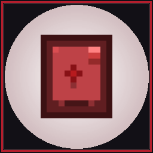

# AE2 Virtual Battle

<div align="center">
  

  **Virtual Mob Drop Generation inside your ME Network for Minecraft 1.21.1 (NeoForge)**

  [](https://minecraft.net/)
  [](https://neoforged.net/)
  [](https://appliedenergistics.org/)
  [](LICENSE)
</div>

---

## ⚔️ About

**AE2 Virtual Battle** is an addon for **Applied Energistics 2** on **Minecraft 1.21.1 (NeoForge)**. It bridges digital ME network storage and virtual combat by introducing generative **Virtual Battle Storage Cells**.

Insert a configured Battle Cell into any standard **ME Drive** or **ME Chest**, supply AE power, and watch it generate real mob drops, monster loot, animal resources, and rare boss drops directly into the cell every 3 seconds (60 ticks)!

---

## ✨ Features

- 📦 **5 Tiers of Virtual Battle Cells:** 1k, 4k, 16k, 64k, and 256k storage cells.
- ⚡ **Scaled Production Rates:** Drops per cycle scale with cell tier (1 up to 256 drops every 3 seconds).
- 🛑 **Zero Network Flooding & Smart Auto-Stop:**
  - Drops are generated **strictly** into the battle cell itself.
  - When the cell reaches full capacity (`CellState.FULL` or byte/type limits), production completely halts.
  - No drops ever spill over into other cells in your ME network!
- 🔋 **Zero Power Waste on Overflow:** When a cell is full, zero AE power is drained for unproduced drops.
- 💀 **Full Vanilla Mob Coverage Out of the Box:**
  - **Hostile Monsters:** Zombie (Rotten Flesh, Iron Ingot, Carrot, Potato), Skeleton (Bone, Arrow, Bow), Creeper (Gunpowder, Music Disc Cat, TNT), Spider & Cave Spider (String, Spider Eye), Enderman (Ender Pearl, End Stone), Blaze (Blaze Rod, Glowstone Dust), Slime (Slimeball), Magma Cube (Magma Cream), Ghast (Ghast Tear, Gunpowder), Witch (Redstone, Glowstone, Sugar, Bottles), Drowned (Nautilus Shell, Copper, Flesh), Husk, Stray, Wither Skeleton (Coal, Bones, Skull), Guardian & Elder Guardian (Prismarine Shard/Crystals, Sponge), Phantom (Membrane, Leather), Shulker (Shulker Shell), Piglin & Zombified Piglin (Gold Nuggets/Ingots, Porkchop), Hoglin (Porkchop, Leather), Breeze (Breeze Rod), Warden (Sculk Catalyst, Echo Shard).
  - **Bosses:** Wither (Nether Star), Ender Dragon (Dragon's Breath, Obsidian, Dragon Head/Egg).
  - **Animals & Farm Creatures:** Cow (Beef, Leather), Pig (Porkchop), Sheep (Mutton, Wool), Chicken (Chicken, Feather, Egg), Squid & Glow Squid (Ink Sacs), Rabbit (Rabbit Meat, Hide, Foot), Iron Golem (Iron Ingots, Poppy).
- 🥚 **Universal Spawn Egg & Trophy Support:**
  - Cells can be partitioned with **Mob Drops** (Rotten Flesh, Bones, Gunpowder, etc.), **Mob Heads**, or **Spawn Eggs** (Vanilla & Modded)!
- 📋 **Datapack Extensible:** Create or customize battle drop tables via standard JSON datapacks using recipe type `ae2virtualbattle:battle_drop`.
- 🛠️ **Two Configuration Methods:**
  - **Cell Workbench (AE2 native):** Put the cell in a Cell Workbench and configure the partition filter slot with your desired mob drop, spawn egg, or mob head.
  - **In-Hand Quick Config:** Hold the battle cell in your main hand and the mob catalyst/drop in your offhand, then **Sneak + Right-Click** to configure instantly! (Sneak + Right-Click with empty offhand resets the cell).
- 📊 **Native AE2 Tooltips:** Displays byte and type usage with color coding (Green → Orange → Red), upgrade cards, and visual item preview icons with amounts.

---

## 📊 Cell Tiers & Rates

By default, drop cycles occur every **60 ticks (3.0 seconds)**:

| Tier | Capacity | Drop Yield | Generation Rate | Idle Power Drain |
| :--- | :--- | :--- | :--- | :--- |
| **1k Virtual Battle Cell** | 1,024 Bytes | **1 Drop** | 1 drop / 3.0s | 0.5 AE/t |
| **4k Virtual Battle Cell** | 4,096 Bytes | **4 Drops** | 4 drops / 3.0s | 1.0 AE/t |
| **16k Virtual Battle Cell** | 16,384 Bytes | **16 Drops** | 16 drops / 3.0s | 2.0 AE/t |
| **64k Virtual Battle Cell** | 65,536 Bytes | **64 Drops** | 64 drops / 3.0s | 4.0 AE/t |
| **256k Virtual Battle Cell** | 262,144 Bytes | **256 Drops** | 256 drops / 3.0s | 8.0 AE/t |

*All drop counts, tick intervals, and AE energy costs (default: 15.0 AE per drop) are fully customizable in `config/ae2virtualbattle-common.toml`.*

---

## 🔨 Crafting Recipes

### 1. Battle Cell Housing
```
[ Quartz Glass ] [ Redstone    ] [ Quartz Glass ]
[ Redstone     ] [ Iron Sword  ] [ Redstone     ]
[ Iron Ingot   ] [ Iron Ingot  ] [ Iron Ingot   ]
```

### 2. 1k Battle Cell Component (Shapeless)
- Combine **1x 1k ME Storage Component** + **1x Rotten Flesh** + **1x Bone**.

### 3. Higher Tier Components (4k, 16k, 64k, 256k)
Crafted following AE2's tier upgrade progression:
- Combine 3x previous tier Battle Cell Components + 1x AE2 Calculation Processor + Quartz Glass + Redstone.

### 4. Complete Storage Cells
Shapeless recipe: Combine a **Battle Cell Housing** with any **Battle Cell Component**.

---

## ⚙️ Configuration (`config/ae2virtualbattle-common.toml`)

```toml
[general]
  # Interval in world ticks between battle drop generation cycles (default 60 = 3.0s)
  baseTickInterval = 60
  # Whether generating battle drops requires AE energy from the ME Network (default true)
  requireAeEnergy = true
  # AE energy consumed per generated mob drop (default 15.0 AE)
  energyPerDrop = 15.0

[tiers]
  tier1kDrops = 1
  tier4kDrops = 4
  tier16kDrops = 16
  tier64kDrops = 64
  tier256kDrops = 256
```

---

## 📜 License
This project is licensed under the MIT License - see the [LICENSE](LICENSE) file for details.
